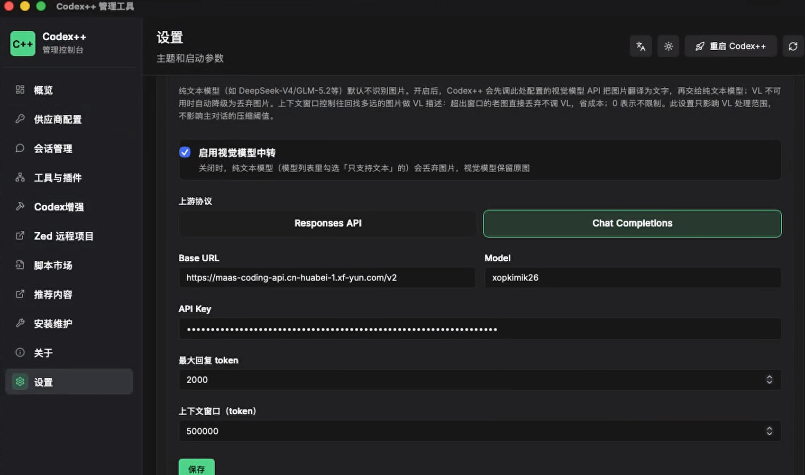
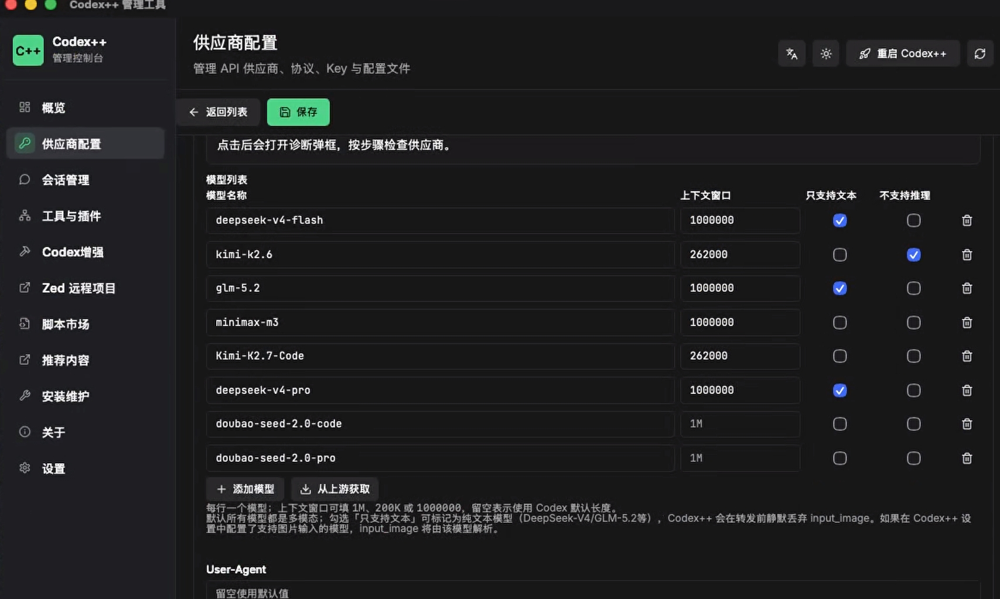

# PR: 纯文本模型图片处理 — per-model 能力判断、VL 视觉模型中转、Reasoning 剥离

> 分支：`strip-images-feature` → `main`
> **19 files changed, +4021 −47**
> 关联 Issue：https://github.com/BigPizzaV3/CodexPlusPlus/issues/1194, https://github.com/BigPizzaV3/CodexPlusPlus/issues/1191

---

## 一、动机与背景

### 1.1 用户痛点

Codex++ 用户常配置纯文本第三方模型（DeepSeek-V4、GLM-5.2等），这些模型存在两类能力缺失：

1. **不支持图片输入** — 用户在对话框上传图片，或 Codex 在执行视觉任务时自动截图发回对话框，模型因无法解析 `image_url` / `input_image` 字段而报错：
   ```
   Failed to deserialize the JSON body into the target type: 
   messages[4]: unknown variant `image_url`, expected `text`
   ```
   或
   ```
   Model do not support image input
   ```

2. **不支持 reasoning 参数** — Codex App 默认在 Responses 请求中携带 `reasoning` 字段，kimi-k2.6 等不支持推理的模型会报错：
   ```
   reasoning is not supported by current model
   ```

维护者 BigPizzaV3 在 [#1191](https://github.com/BigPizzaV3/CodexPlusPlus/issues/1191) 和 [#1194](https://github.com/BigPizzaV3/CodexPlusPlus/issues/1194) 中明确建议：**按供应商/模型粒度配置能力标记，在转发前移除或替换不支持的字段**；不要全局默认移除，以免影响支持多模态的上游。

### 1.2 架构约束

Codex++ 的代理（proxy）在两种协议下行为不同：

```
Codex App → Proxy (127.0.0.1:57321) → 上游 (Ark / 讯飞 / ...)
              │
              ├─ Chat Completions 协议：代理拦截，做协议转换（Responses → Chat），再发上游
              └─ Responses 协议：纯透传，代理不干预，直连上游
```

- **Chat Completions 协议**：请求必须经过 proxy 做协议转换，这是插入 strip/VL 逻辑的天然锚点
- **Responses 协议**：pureApi 模式直连上游，proxy 被跳过，strip/VL 永远不会执行

本次 PR 的设计决策：**Response 格式始终 pureApi 直连（不拦截），Chat 格式始终走 proxy（含 strip/VL/reasoning 处理）**。

### 1.3 方案演进历程

本 PR 经历了多轮迭代，设计文档完整保留在 `docs/specs/` 和 `docs/handoff/` 目录：

| 阶段 | 文档 | 内容 |
|------|------|------|
| 原始设计 | `docs/specs/2026-07-09-text-only-model-image-handling-design.md` | 三大路径（A: strip 防错、B: VL 中转识图、C: 配置 UI）的完整架构设计 |
| 首次实施 | `docs/execution-logs/2026-07-10-strip-images-execution-log.md` | 路径 A+C MVP 的实施记录 |
| Bug 修复 | `docs/specs/2026-07-12-strip-images-followup-bugfix-design.md` | Responses 透传 bug 根因分析 + per-model map + reasoning strip 设计 |
| 续补实施 | `docs/handoff/2026-07-12-strip-images-followup-handoff.md` | VL 中转、per-model UI、带问题识图等全部功能的完整交接 |
| 纯文本模型修复 | `docs/handoff/2026-07-12-reasoning-strip-handoff.md` | reasoning strip + stripImages/map 冲突修复 + VL 进阶 |
| 架构决策 | `docs/handoff/2026-07-13-pureapi-proxy-decision-handoff.md` | Response pureApi vs proxy 的架构决策记录 |

---

## 二、整体架构

### 2.1 数据流（最终版）

```
Codex App (Chat Completions 协议)
    │
    │  POST /v1/responses  →  body 含 model + input[input_text, input_image...] + reasoning
    ▼
┌──────────────────────────────────────────────────────────────────────┐
│  Proxy (127.0.0.1:57321)                                            │
│                                                                      │
│  ① apply_vl_with_fallback(relay, body, vision_relay, user_agent)    │
│     │                                                                │
│     ├─→ model_supports_image(relay, model)                          │
│     │   ├─ per-model map 命中 → 用 map 值                           │
│     │   ├─ map 非空但未命中 → 默认 true（视觉模型不被误伤）          │
│     │   └─ map 空/非法 → 回退全局 strip_images 开关                 │
│     │                                                                │
│     ├─ 视觉模型 OR VL 未启用 → 直接返回 (supports_image, body)      │
│     │                                                                │
│     └─ 纯文本模型 AND VL 启用 → analyze_images_with_vl()            │
│         │                                                            │
│         ├─ context_window > 0 → 从末尾累积 token，窗口内的图调 VL    │
│         │   context_window = 0 → 全部图调 VL（不限制）              │
│         │                                                            │
│         ├─ 收集同条消息的 input_text 作为用户提问                    │
│         │   （"用户想了解：{text}" → VL 聚焦用户关心内容）          │
│         │                                                            │
│         ├─ 逐张图调 VL API → 文字描述                                │
│         │   ├─ VL protocol = ChatCompletions:                        │
│         │   │   image_url 用对象格式 {"url": "..."}                  │
│         │   │   参数名 max_tokens                                    │
│         │   │  响应路径 choices[0].message.content                   │
│         │   ├─ VL protocol = Responses:                              │
│         │   │   image_url 用字符串格式 "..."                         │
│         │   │   参数名 max_output_tokens                             │
│         │   │   响应路径 output[0].content[0].text                   │
│         │   └─ 替换：input_image → input_text (描述文字)             │
│         │                                                            │
│         ├─ 窗口外的图 → 直接 strip（不调 VL，省成本）               │
│         │                                                            │
│         ├─ VL 全部成功 → 返回 (supports_image=true, vl_body)         │
│         └─ VL 失败 → 返回 (supports_image=false, original_body)      │
│                       ↓ 降级为 strip（不阻断用户请求）              │
│                                                                      │
│  ② upstream_request_parts(relay, body, supports_image)              │
│     │                                                                │
│     ├─ Chat Completions 分支：                                       │
│     │   ├─ responses_to_chat_completions_with_image_support(         │
│     │   │       body, supports_image)                                │
│     │   │   └─ supports_image=true  → image_url 保留                │
│     │   │   └─ supports_image=false → image_url 替换为纯文本         │
│     │   └─ apply_chat_reasoning_options() → 按模型风格转换 reasoning │
│     │                                                                │
│     └─ Responses 分支：                                              │
│         └─ 纯透传，不干预（图片/reasoning 原样发给上游）             │
│                                                                      │
│  ③ 发送上游                                                          │
└──────────────────────────────────────────────────────────────────────┘
    │
    ▼
  上游 (Ark / 讯飞 / ...)
```

### 2.2 协议行为对照表

| 场景 | Chat Completions 协议 | Responses 协议 |
|------|----------------------|----------------|
| 视觉模型 + 图片 | 原样转发，协议转换 | 纯透传 |
| 纯文本模型 + 图片 + VL 启用 | VL 识图 → 文字描述 → 发给主模型 | 纯透传（图片由上游自行处理） |
| 纯文本模型 + 图片 + VL 关闭 | 丢弃图片 | 纯透传 |
| 不支持 reasoning 的模型 | 按模型风格剥离/转换 reasoning | 纯透传 |
| 支持 reasoning 的模型 | 原样转发 | 纯透传 |

**核心原则**：只有 Chat Completions 协议会经过 proxy 做协议转换，strip/VL/reasoning 处理都在这条路径上完成。Responses 协议直连上游，不做任何干预。

---

## 三、后端变更详解

### 3.1 唯一核心文件：`crates/codex-plus-core/src/protocol_proxy.rs`

本次 PR 只修改了一个核心 Rust 文件（其余后端文件仅为 settings 字段的初始化适配），新增约 400 行代码，分四个功能层：

#### 层 1：per-model 能力判断（基础层）

**问题**：不同模型的能力不同。deepseek-v4-flash 不支持图片，kimi-k2.6 不支持推理，minimax-m3 两者都支持。需要一个精确到模型粒度的能力查询机制。

**方案**：前端 per-model 表格的配置存在 `modelImageSupport` 和 `modelReasoningSupport` 两个 JSON map 中（如 `{"deepseek-v4-flash": false, "glm-5.2": false}`），后端查询时做大小写不敏感匹配。

新增 4 个函数：

| 函数 | 签名 | 职责 |
|------|------|------|
| `lookup_model_bool_support` | `(map_json, model) -> Option<bool>` | 大小写不敏感查 per-model JSON map。非法 JSON / 空字符串 / model 未命中 → None |
| `model_bool_map_is_valid_and_nonempty` | `(map_json) -> bool` | 判断 map 是否有效 JSON 且非空（`"not json"` 不会被误判为"非空有效 map"） |
| `model_supports_image` | `(relay, model) -> bool` | map 命中 → 用 map 值；map 非空未命中 → 默认 true（不误伤视觉模型）；map 空 → 回退 `!strip_images` |
| `model_supports_reasoning` | `(relay, model) -> bool` | map 命中 → 用 map 值；未命中 → 默认 true（支持推理） |

**设计要点**：
- **大小写不敏感**：Codex 发送的 model 名（如 `glm-5.2`）可能与 map key（如 `GLM-5.2`）大小写不一致
- **map 非空未命中默认 true**：解决了用户反馈的"cherry 中转 stripImages=true + modelImageSupport 只有 deepseek/glm，但 kimi-2.6 被误 strip"的问题。视觉模型不受 `strip_images` 全局开关影响
- **向后兼容**：map 为空时自动回退到 `strip_images` 全局开关

#### 层 2：strip 函数（数据处理层）

**问题**：纯文本模型收到的 `input_image` 块和不支持推理模型的 `reasoning` 字段需要从 body 中移除。

新增 2 个函数：

| 函数 | 职责 |
|------|------|
| `strip_input_images_in_place(body, supports_image)` | `supports_image=true` 时 no-op；false 时遍历 `body.input[].content[]`，移除所有 `type=="input_image"` 的 part。input/content 为字符串时安全跳过（不崩溃） |
| `strip_reasoning_in_place(body, supports_reasoning)` | `supports_reasoning=true` 时 no-op；false 时移除 `body["reasoning"]` |

#### 层 3：VL 视觉模型中转（异步 I/O 层）

**问题**：纯文本模型完全无法理解图片内容。直接丢弃图片会让用户丢失图片中的信息。需要一个方案：在丢弃图片之前，先让视觉模型"看图说话"，把图片内容翻译成文字，再交给纯文本模型。

**方案**：用户在 Codex++ 设置中配置一个视觉模型（如 Qwen-VL-Plus、GPT-5.5 等），当纯文本模型收到图片时，proxy 先调用该 VL API 描述图片，把文字描述替换原 `input_image` 块，再发给主模型。

新增 7 个函数：

| 函数 | 职责 |
|------|------|
| `estimate_item_tokens(item)` | 粗估 input item 的 token 数（文本字符数 / 4），跳过 base64 图片数据。支持 content 为字符串和数组两种格式 |
| `items_within_vl_window(input, context_window)` | 从末尾反向遍历 input items，累积 token 直到超过 `context_window`。`context_window=0` 表示不限制，返回全部索引。**与主对话压缩无关**，仅控制 VL 处理的图片范围 |
| `collect_input_text(input)` | 从 input items 中收集用户原文（同一条消息里的 `input_text`），用于 VL 的"带问题识图" |
| `extract_image_url(part)` | 从 `input_image` part 提取 image_url。兼容字符串格式（Responses: `"image_url": "https://..."`）和对象格式（ChatCompletions: `"image_url": {"url": "https://..."}`） |
| `describe_image_with_vl(image_url, user_text, vl_config, client)` | 调 VL API 描述单张图。按 `vl_config.protocol` 适配请求格式和响应解析路径 |
| `analyze_images_with_vl(body, vl_config, client)` | 遍历 input 中的 `input_image` → 窗口内的调 VL → 替换为 `input_text` 描述文字；窗口外的直接 strip |
| `apply_vl_with_fallback(relay, body, vision_relay, user_agent)` | VL 总入口：判断是否需要 VL → 成功返回 `(true, body)` 让后续 strip no-op；失败降级返回 `(false, original)` 走 strip（**不阻断用户请求**） |

**上下文窗口机制**（与主对话压缩独立）：

```
用户设 contextWindow = 100000 tokens（约 25 万字符）

input items:  [msg1: 10k tokens]  [msg2: 20k tokens + 🖼️]  [msg3: 30k tokens]  [msg4: 50k tokens + 🖼️🖼️]

从末尾累积:    50k                 80k (>100k? no)         110k (>100k? yes, stop)
                                                     ↑ msg3 也包含，因为累积到 msg3 时 tokens=50k+30k=80k ≤ 100k

结果: msg3 和 msg4 在窗口内 → msg4 的两张图调 VL 描述
      msg1 和 msg2 在窗口外 → msg2 的图直接 strip（不调 VL）
```

**带问题识图**：

```
用户消息: [input_text: "这个报错是什么意思？"] [input_image: screenshot.png]

→ VL prompt = "用户想了解：这个报错是什么意思？
              请根据图片详细描述与用户问题相关的内容，包括文字、UI 元素、错误信息、布局结构。请用中文回复。"

vs. 无用户文字: VL prompt = "简要描述这张图片"
```

**VL API 协议适配**：`vl_config.protocol` 决定调用 VL 模型时用什么格式，与主 relay 协议独立。代码支持两种格式作为技术储备，但实际触发 VL 的只有 Chat Completions 路径（Response 格式直连不经过 proxy）。

| 协议 | image_url 格式 | token 参数名 | 响应解析路径 | 备注 |
|------|---------------|-------------|------------|------|
| ChatCompletions | `{"url": "..."}` (object) | `max_tokens` | `choices[0].message.content` | 实际使用 |
| Responses | `"..."` (string) | `max_output_tokens` | `output[0].content[0].text` | 技术储备 |

#### 层 4：主链路串联

**修改 1：`upstream_request_parts` 签名变更**

从内部自行计算 `supports_image`，改为接受外部预计算的值：

```diff
- fn upstream_request_parts(relay, request_json)
+ fn upstream_request_parts(relay, request_json, supports_image: bool)
```

- Chat 分支：用传入的 `supports_image` 决定是否 strip 图片
- Responses 分支：纯透传，不做任何干预

**修改 2：`open_responses_proxy_request_with_settings_and_user_agent` 集成 VL**

在代理主循环中，请求发往上游之前，先调 VL 预处理：

```diff
  for relay in relays {
      validate_upstream(&relay)?;
-     let (endpoint, upstream_body, wire_api) =
-         upstream_request_parts(&relay, request_json.clone())?;
+     let (supports_image, body_with_vl) = apply_vl_with_fallback(
+         &relay, request_json.clone(), &settings.vision_relay, &user_agent
+     ).await?;
+     let (endpoint, upstream_body, wire_api) =
+         upstream_request_parts(&relay, body_with_vl, supports_image)?;
      // ... 发送上游 ...
  }
```

**可见性修复**：
- `has_version_suffix` 从 `fn` 改为 `pub`（`model_catalog.rs` 依赖此函数判断 base URL 是否含版本后缀）
- 新增 pub wrapper `upstream_request_parts_with_image_decision`（测试文件导入依赖）

### 3.2 配置结构：`crates/codex-plus-core/src/settings.rs`（+256 行）

新增字段：

```rust
// RelayProfile 新增 per-model 能力 map
pub model_image_support: String,     // JSON map: {"deepseek-v4-flash": false, "glm-5.2": false}
pub model_reasoning_support: String, // JSON map: {"kimi-k2.6": false}

// BackendSettings 新增 VL 中转配置
pub vision_relay: VisionRelayConfig,
```

`VisionRelayConfig` 结构体：

| 字段 | 类型 | 默认值 | 说明 |
|------|------|--------|------|
| `enabled` | `bool` | `false` | VL 中转总开关 |
| `model` | `String` | `""` | VL 模型名（如 `qwen-vl-plus`） |
| `api_key` | `String` | `""` | VL API 的 Key |
| `base_url` | `String` | `""` | VL API 地址 |
| `protocol` | `RelayProtocol` | `ChatCompletions` | VL API 的协议类型 |
| `max_tokens` | `u32` | `256` | VL 回复的最大 token 数 |
| `context_window` | `u64` | `0` | VL 上下文窗口，0 = 不限制 |

### 3.3 其他后端文件

| 文件 | 变更 | 说明 |
|------|------|------|
| `http_client.rs` | +7 | `proxied_client()` 加 `.no_proxy()`，避免 macOS 系统代理拦截 `127.0.0.1` 内网请求 |
| `ccs_import.rs` | +3 | settings 新字段初始化适配 |
| `provider_import.rs` | +3 | settings 新字段初始化适配 |
| `tests/launcher.rs` | +3 | settings 新字段初始化适配 |

### 3.4 后端测试

| 测试文件 | 用例数 | 说明 |
|---------|--------|------|
| `tests/protocol_proxy.rs` | **82** | 覆盖：per-model 图片能力判断（map 命中/未命中/空 map/非法 JSON/大小写不敏感）、reasoning 能力判断、strip 函数（noop/实际 strip/字符串 content 安全）、VL 预处理（noop/替换/用户文字/max_tokens 可配/无文字降级固定 prompt/Responses 协议/context_window/失败降级 fallback）、Responses 透传（图片+reasoning 保留）、集成测试 |
| `tests/relay_config.rs` | **93** | 回归（无新增，确认未受影响） |
| `tests/launcher.rs` | **60** | 回归（无新增，确认未受影响） |

---

## 四、前端变更详解

### 4.1 视觉模型中转（VL）设置区：`App.tsx`

在 Codex++ 设置页面新增「视觉模型中转（VL）」配置 block：

```
┌─ 视觉模型中转（VL） ─────────────────────────────────┐
│                                                        │
│  纯文本模型（如 DeepSeek-V4/GLM-5.2等）默认不识别图片。 │
│  开启后，Codex++ 会先调此处配置的视觉模型 API           │
│  把图片翻译为文字，再交给纯文本模型；                   │
│  VL 不可用时自动降级为丢弃图片。                        │
│                                                        │
│  上下文窗口特指调用视觉模型的窗口长度，                 │
│  窗口范围内的图片及文字整体发给视觉模型调用 VL；        │
│  0 表示不限制。此设置只影响 VL 处理范围，              │
│  不影响主对话的压缩阈值。                               │
│                                                        │
│  [√] 启用视觉模型中转                                  │
│                                                        │
│  协议:  [Chat Completions] [Responses]                 │
│                                                        │
│  Base URL:   [________________________]                │
│  VL 模型:    [________________________]                │
│  API Key:    [________________________]                │
│  最大回复 token:  [256]                                │
│  上下文窗口:  [0________]  留空不限制                  │
│                                                        │
│  [保存]                                                │
└────────────────────────────────────────────────────────┘
```

- **启用开关**：控制 VL 中转总开关
- **协议切换 tab**：VL 模型自身的 API 协议，与主 relay 协议无关。提示文字："仅 Chat Completions 格式的请求会触发 VL 处理"
- **maxTokens**：控制 VL 回复的详细程度，默认 256
- **contextWindow**：0 显示为空，占位符"留空不限制"
- **独立保存按钮**：VL 设置有显式保存按钮，不依赖页面级保存



### 4.2 per-model 能力表格：`App.tsx` + `model-windows.ts`

在供应商配置的模型列表表格中新增两列：

```
┌─ 模型列表 ────────────────────────────────────────────────┐
│                                                           │
│  每行一个模型；上下文窗口可填 1M、200K 或 1000000，       │
│  留空表示使用 Codex 默认长度。                            │
│                                                           │
│  以下仅在选择 Chat Completions 协议时生效：               │
│  勾选「只支持文本」可标记为纯文本模型                     │
│  （DeepSeek-V4/GLM-5.2等），                              │
│  Codex++ 会在转发前静默丢弃 input_image；                 │
│  务必同时在 Codex++ 设置中配置支持图片输入的模型，        │
│  input_image 将由该模型解析。                             │
│                                                           │
│  ┌──────────────┬──────────┬──────────┬──────────┬──────┐ │
│  │ 模型名称      │ 上下文窗口│ 只支持文本│ 不支持推理│ 删除 │ │
│  ├──────────────┼──────────┼──────────┼──────────┼──────┤ │
│  │ deepseek-v4  │ 1M       │ [√]      │ [ ]      │ [×]  │ │
│  │ glm-5.2      │ 200K     │ [√]      │ [ ]      │ [×]  │ │
│  │ kimi-k2.6    │          │ [ ]      │ [√]      │ [×]  │ │
│  │ minimax-m3   │          │ [ ]      │ [ ]      │ [×]  │ │
│  └──────────────┴──────────┴──────────┴──────────┴──────┘ │
│                                                           │
│  [从上游获取]                                             │
└───────────────────────────────────────────────────────────┘
```

**关键设计决策**：

- **移除全局 `stripImages` checkbox**：从 profile 级开关改为 per-model 粒度，更精确
- **列名"只支持文本"而非"支持图片"**：`textOnly` 默认 `false`，因为多模态是模型的默认自然状态，纯文本才是需要标记的例外
- **"不支持推理"列**：独立于图片能力，kimi-k2.6 不支持推理但支持图片，minimax-m3 两者都支持
- **注释明确标注协议范围**："以下仅在选择 Chat Completions 协议时生效"，避免用户误以为 Responses 格式也会 strip



### 4.3 前端数据层：`model-windows.ts`（+89 行）

`ModelWindowRow` 类型扩展：

```typescript
type ModelWindowRow = {
  model: string;
  window: string;
  textOnly: boolean;      // 新增 → 序列化为 modelImageSupport
  noReasoning: boolean;   // 新增 → 序列化为 modelReasoningSupport
};
```

新增/修改的工具函数：

| 函数 | 职责 |
|------|------|
| `modelImageSupportMapToRows(mapJson)` | 解析 JSON map → `Map<string, boolean>`（存为 `textOnly` 的反义值） |
| `modelWindowRowsFromProfile(profile, modelImageSupport, modelReasoningSupport)` | 从 profile 读取 per-model 配置，合成行数据 |
| `serializeModelWindowRows(rows)` | 从行控件生成 `modelList`、`modelWindows`、`modelImageSupport`、`modelReasoningSupport` 四个字段 |

### 4.4 前端测试：`model-windows.test.ts`（+127 行）

新增 18 个单元测试，覆盖：
- `modelImageSupport` map 的解析和序列化
- `modelReasoningSupport` map 的解析和序列化
- `textOnly` / `noReasoning` 字段在 `modelWindowRowsFromProfile` 和 `serializeModelWindowRows` 之间的往返
- 未配置时默认值（`textOnly=false` 多模态、`noReasoning=false` 支持推理）
- 非法 JSON 的容错处理

### 4.5 其他前端文件

| 文件 | 变更 | 说明 |
|------|------|------|
| `styles.css` | +40 | per-model 表格列宽优化（模型名/上下文窗口/只支持文本/不支持推理/删除 五列对齐） |
| `i18n-en.ts` | +4 | VL 上下文窗口说明和 per-model 表格注释的英文翻译 |

---

## 五、关键设计决策与取舍

### 5.1 为什么 Response 格式不处理图片和 reasoning？

Response 格式走 pureApi 模式直连上游，不经过 proxy。最初尝试过让 Response 格式也自动走 proxy（根据 per-model map 判断是否需要），但用户测试发现：
1. **VPN 兼容性**：挂 VPN 时走 proxy 会导致 Codex 不通
2. **架构清晰性**：Response = pureApi（直连）、Chat = proxy（转换），分工明确
3. **上游自身处理**：Ark 等上游对 Response 格式有自己的模型能力校验，不需要 proxy 重复处理

### 5.2 为什么 per-model map 非空时未命中模型默认 true？

用户实际配置场景：cherry 中转 `stripImages=true` + `modelImageSupport={"deepseek-v4-flash":false, "glm-5.2":false}`。此时 kimi-k2.6（视觉模型，不在 map 里）如果走 fallback `!strip_images = false`，会被误 strip。

修复后的逻辑：map 有效且非空 → 说明用户在"精确配置哪些模型是纯文本"，不在列表里的模型默认是视觉模型（true）。只有 map 为空时才回退到全局开关，保持向后兼容。

### 5.3 为什么 VL 失败降级为 strip 而不是报错？

VL API 可能因为网络、限流、Key 失效等原因调用失败。如果 VL 失败就阻断用户请求，用户体验太差。降级为 strip（丢弃图片）至少保证请求能发出去，用户能看到文字回复。

诊断日志记录了 `protocol_proxy.vl_preprocess_failed` 事件，方便排查。

### 5.4 为什么 VL 上下文窗口和主对话压缩独立？

主对话的压缩阈值由 Codex App 自身控制（`config.toml` 的 `context_window`）。VL 的上下文窗口控制的是"往回看多远去调 VL 描述图片"，两者是不同层：

- 主对话压缩：Codex 决定给模型发多少历史消息
- VL 上下文窗口：proxy 决定哪些图片需要 VL 描述（窗口外的老图直接丢弃不调 VL，省 VL API 费用）

---

## 六、测试覆盖

### 后端测试（全部通过）

| 测试套件 | 用例数 | 结果 |
|---------|--------|------|
| `cargo test --test protocol_proxy` | 82 | ✅ 全部通过 |
| `cargo test --test relay_config` | 93 | ✅ 全部通过 |
| `cargo test --test launcher` | 60 | ✅ 全部通过 |

protocol_proxy 82 个用例覆盖：
- **per-model 能力判断**：map 命中/未命中、大小写不敏感、空 map、非法 JSON、map 非空未命中默认 true
- **strip 函数**：noop（supports_image=true）、实际 strip、字符串 content 安全跳过、reasoning 字段移除/保留
- **VL 预处理**：VL 关闭 noop、无图片 noop、图片替换为文字描述、用户文字传给 VL、max_tokens 可配、无文字降级固定 prompt、Responses 协议适配、context_window 窗口限制、VL 失败降级
- **Responses 透传**：图片和 reasoning 均保留原样
- **集成测试**：Chat 分支 strip + Responses 分支透传的组合场景

### 前端测试（全部通过）

| 测试套件 | 用例数 | 结果 |
|---------|--------|------|
| `npx vitest run` (model-windows) | 18 | ✅ 全部通过 |
| `npx tsc --noEmit` | — | ✅ 0 error |

### 编译验证

| Binary | 结果 |
|--------|------|
| `cargo build --bin codex-plus-plus` | ✅ 编译成功 |
| `cargo build --bin codex-plus-plus-manager` | ✅ 编译成功 |

---

## 七、向后兼容性

- **`strip_images` 全局开关保留**：per-model map 为空时自动回退到此开关，已有配置不受影响
- **未配置 `modelImageSupport` 的 relay**：行为不变，所有模型默认视为支持图片
- **未配置 `modelReasoningSupport` 的 relay**：行为不变，所有模型默认视为支持推理
- **VL 未启用时**：不影响现有行为，纯文本模型走 strip 逻辑
- **settings.json 兼容**：所有新字段使用 `#[serde(default, skip_serializing_if = "String::is_empty")]`，旧配置文件反序列化不会报错

---

## 八、文件变更总览

| 文件 | + | − | 说明 |
|------|---|---|------|
| `crates/codex-plus-core/src/protocol_proxy.rs` | +411 | −7 | **核心**：per-model 判断 + strip + VL 预处理（含 30s 超时 + 10 张上限）+ 主链路串联 |
| `crates/codex-plus-core/src/settings.rs` | +256 | — | VisionRelayConfig + modelImageSupport + modelReasoningSupport |
| `crates/codex-plus-core/tests/protocol_proxy.rs` | +1194 | −? | 82 个测试用例 |
| `apps/codex-plus-manager/src/App.tsx` | +195 | −? | VL 设置区 + per-model 表格 + 注释文字 |
| `apps/codex-plus-manager/src/model-windows.ts` | +89 | −? | textOnly + noReasoning 字段 + 序列化工具 |
| `apps/codex-plus-manager/src/model-windows.test.ts` | +127 | −? | 18 个前端测试 |
| `apps/codex-plus-manager/src/styles.css` | +40 | — | per-model 表格列宽优化 |
| `apps/codex-plus-manager/src/i18n-en.ts` | +4 | — | 英文翻译 |
| `crates/codex-plus-core/src/http_client.rs` | +7 | −? | `.no_proxy()` 避免系统代理拦截 |
| `crates/codex-plus-core/src/ccs_import.rs` | +3 | — | settings 初始化适配 |
| `crates/codex-plus-core/src/provider_import.rs` | +3 | — | settings 初始化适配 |
| `crates/codex-plus-core/tests/launcher.rs` | +3 | — | settings 初始化适配 |
| `docs/execution-logs/2026-07-10-strip-images-execution-log.md` | +484 | — | 首次实施执行日志 |
| `docs/execution-logs/2026-07-13-strip-images-rebuild-execution-log.md` | +268 | — | 重建实施执行日志 |
| `docs/specs/2026-07-09-text-only-model-image-handling-design.md` | +258 | — | 原始架构设计 spec |
| `docs/specs/2026-07-12-strip-images-followup-bugfix-design.md` | +210 | — | Bug 修复设计 spec |
| `docs/handoff/2026-07-12-reasoning-strip-handoff.md` | +113 | — | reasoning strip 交接文档 |
| `docs/handoff/2026-07-12-strip-images-followup-handoff.md` | +233 | — | 全部功能交接文档 |
| `docs/handoff/2026-07-13-pureapi-proxy-decision-handoff.md` | +170 | — | 架构决策记录 |
| **合计 19 个文件** | **+4021** | **−47** | |

---

## 九、已知局限与后续方向

以下不在本次 PR 范围内，建议后续迭代：

1. **VL base64 图片体积控制**：大图 data URL 会导致 VL 请求体过大，需加体积阈值（参考 image-router 的 4MB 限制）
2. **VL 流式请求**：当前 VL 调用只支持非流式
3. **per-model 批量标记 UI**：模型多时一个个勾选效率低，可加"全选当前列表"等批量操作
4. **VL "测试连接"按钮**：类似 Stepwise 的 `test_stepwise_settings`，让用户填完能即时验证 VL 配置是否正确
5. **历史图片缓存**：当前每次请求重新调 VL，没有 LRU 缓存机制。同一会话里同一张图会重复调 VL，浪费费用

---

## 十、与 PR #1405 的对比

@kanchengw 在 #1405 独立实现了一个同系列的 VLM 视觉分析功能。以下逐维度对比，供维护者参考合并决策。

### 10.1 整体对比

| 维度 | PR #1405 (kanchengw) | 本 PR |
|------|---------------------|-------|
| **核心理念** | 纯文本模型走 VLM 分析，图片 → 文字描述（主路径），strip 为辅 | 先判断 per-model 能力，再决定 VL 识图还是 strip；Response 纯透传 |
| **VLM 配置位置** | 在 RelayProfile 上（per-relay 粒度） | 在 BackendSettings 上（全局唯一 VL 配置） |
| **VL 处理深度** | 两阶段：同步处理当前轮+黄金窗口（10轮），后台补深层 | 单次：只处理当前请求中 context_window 范围内的图（最多 10 张） |
| **图片缓存** | LRU 缓存（500 条，24h TTL），历史图片可缓存命中 | 无缓存，每次重新调 VL |
| **Response 协议处理** | 同时处理 Chat + Responses 两个路径 | Chat 走 proxy（strip/VL），Responses 纯透传 |
| **新增文件** | `vision.rs`（1822 行，独立模块） | 全部在 `protocol_proxy.rs` 内（~400 行） |
| **新增依赖** | wiremock, sha2, assert-json-diff | 无新增依赖 |
| **测试** | 43 个（含 8 个 wiremock 集成测试） | 82 个（含 VL + strip + per-model 能力全覆盖） |
| **Reasoning 处理** | ❌ 未涉及 | ✅ modelReasoningSupport + strip_reasoning_in_place |

### 10.2 VL 入口位置差异

**PR #1405**：在 `upstream_request_parts` 内直接插 VL，覆盖 Chat 和 Responses 两个分支。VL 逻辑是同步阻塞在协议转换之后的。

**本 PR**：在 `open_responses_proxy_request_with_settings_and_user_agent` 外层异步预处理 VL，然后 `upstream_request_parts` 接收预计算的 `supports_image`。Response 分支不触发 VL。两层解耦。

### 10.3 VLM 配置粒度差异

**PR #1405**：per-relay 配置，每个供应商可以有独立的 VLM Key/Model/BaseURL。更灵活但配置成本高。

**本 PR**：全局唯一 VL 配置，所有 relay 共用。更简单但不够灵活。另外支持 VL 自身协议切换（ChatCompletions / Responses）、max_tokens 可配、独立 context_window。

### 10.4 历史图片处理差异（最重要的设计差异）

**PR #1405**：两阶段分析 + LRU 缓存。Phase 1 同步处理当前轮+黄金窗口 10 轮；Phase 2 后台分析深层图片写入缓存。历史图片可以在后续轮次被缓存命中，不需要重复调 VL。**可以恢复被图片污染的旧会话。**

**本 PR**：单轮处理，每次请求独立。context_window 范围内的图都调 VL（每次重新调，不缓存）；context_window 外的直接 strip。旧会话的图片如果在窗口内会重新 VL 描述；如果在窗口外则 strip。**不能恢复被污染的旧会话，但新会话不构成问题。**

### 10.5 失败策略差异

**PR #1405**：fail-closed（全部失败保留原图）。VL 不可达时图片保留，不丢失信息，但纯文本模型可能再次报错。

**本 PR**：fail-open + 降级（VL 失败走 strip）。VL 不可达时丢弃图片保证请求能发出，宁可丢图也不阻断用户。

### 10.6 工程质量对比

**PR #1405 优势**：
- HTTP 超时（连接 5s + 请求 30s + 总 120s）＜ 本 PR 也有单次 30s 超时，×10 张最多 300s
- 并发控制（per-request 3 + 全局 5 信号量）＞ 本 PR 串行调 VL
- 图片数量上限（历史 10 张 + 深度 50 轮）≈ 本 PR 也有 10 张上限 + context_window 限制
- wiremock 集成测试覆盖真实 HTTP 场景 ＞ 本 PR 用 mock server 模拟

**本 PR 优势**：
- 双维度能力判断（图片 + 推理）＞ #1405 只有图片
- Per-model map fallback 逻辑更完善（非空未命中默认 true，不误伤视觉模型）
- VL max_tokens 可配、协议可切换 ＞ #1405 固定 ChatCompletions
- 无新依赖 ＞ #1405 新增 3 个依赖
- 82 个测试覆盖更全面

### 10.7 功能覆盖矩阵

| 功能 | PR #1405 | 本 PR |
|------|----------|-------|
| 纯文本模型 strip 图片 | ✅ | ✅ |
| VL 识图替换 | ✅（当前轮 + 历史多轮） | ✅（当前请求，最多 10 张） |
| VL 图片缓存 | ✅ LRU | ❌ |
| 历史会话恢复 | ✅（两阶段 + 缓存） | ❌ |
| per-model 图片能力 map | ✅ modelVlm JSON | ✅ modelImageSupport JSON |
| per-model 推理能力 map | ❌ | ✅ modelReasoningSupport JSON |
| Reasoning strip | ❌ | ✅ strip_reasoning_in_place |
| VL max_tokens 可配 | ❌ | ✅ |
| VL 协议适配 | 固定 ChatCompletions | ChatCompletions + Responses |
| HTTP 超时 | ✅ 5/30/120s | ✅ 单次 30s |
| 并发控制 | ✅ 3+5 信号量 | ❌ 串行 |
| 图片数量上限 | ✅ 10 张/50 轮 | ✅ 10 张 |
| 失败策略 | fail-closed | 降级 strip |
| Response 格式处理 | 两个分支 | Chat 走 proxy，Response 纯透传 |
| 全局 strip 向后兼容 | ❌ | ✅ strip_images fallback |

### 10.8 两个 PR 是否可以共存？

可以。修改的文件有重叠但改动区域不同：

| 文件 | PR #1405 | 本 PR | 冲突风险 |
|------|----------|-------|---------|
| `protocol_proxy.rs` | 在 `upstream_request_parts` 加 VLM hook | 新增 10+ 个函数 + 改签名 | ⚠️ 中等 |
| `settings.rs` | 加 4 个 RelayProfile 字段 | 加 2 个 RelayProfile 字段 + VisionRelayConfig | ⚠️ 中等 |
| `App.tsx` | Per-model VLM 列 | VL 设置区 + per-model 双列 | ⚠️ 需手动合并 |
| `vision.rs` | 新文件 1822 行 | — | 无冲突 |

### 10.9 维护者 Review 意见对照

BigPizzaV3 在 #1405 提了 6 条阻塞意见。对照本 PR 的状态：

| Review 条目 | 本 PR 状态 |
|------------|-----------|
| 1. Responses 模式不经过代理 | ✅ 已标注：前端注释 + VL tab 提示"仅 Chat 格式触发" |
| 2. HTTP 超时 | ✅ 已加：单次 VL 调用 `.timeout(30s)`，10 张图最多 300s |
| 3. 历史图片处理 | ⚠️ 部分：每次重调 VL 但不缓存，旧会话图片在 context_window 内会重新描述，窗口外 strip |
| 4. 全部失败判断不可达 | ✅ 不适用：二元成功/失败，不存在部分失败场景 |
| 5. UI 校验 | ✅ API Key 已用 `type="password"` |
| 6. 并发/图片上限 | ✅ 图片上限 10 张；串行调 VL 无并发问题 |

---
